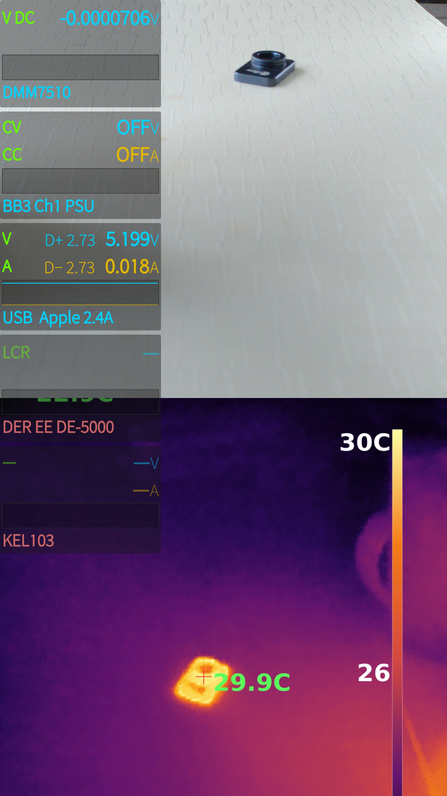
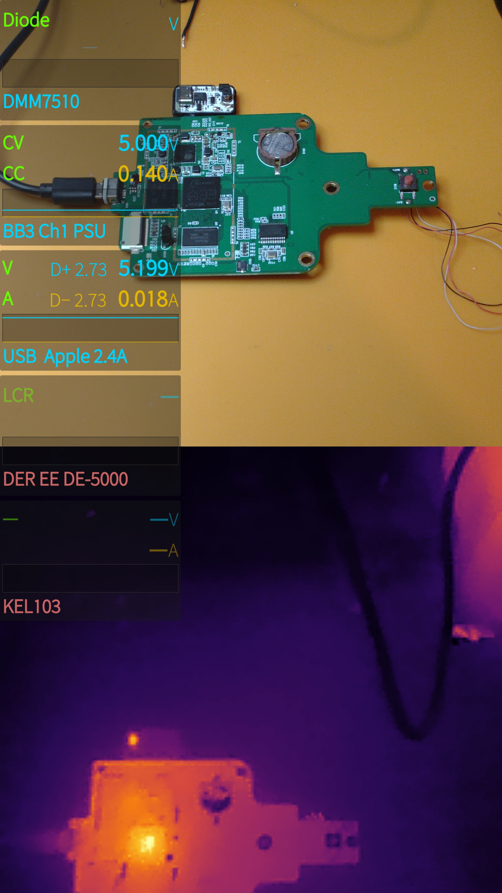
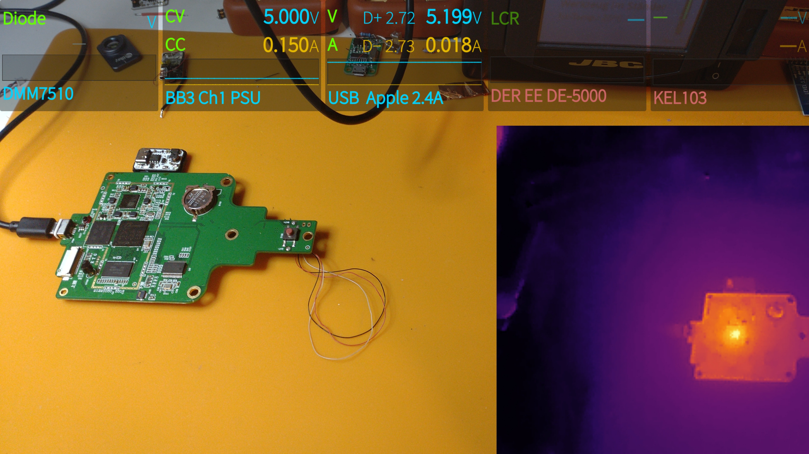
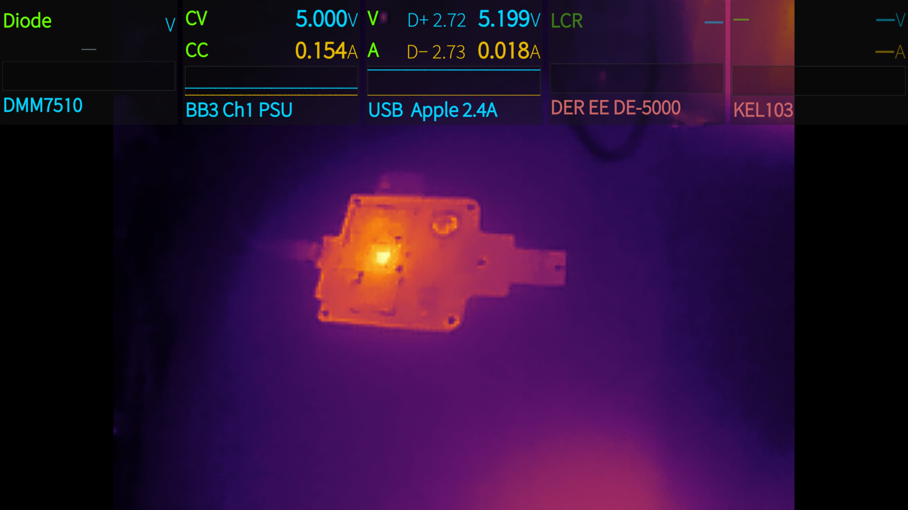
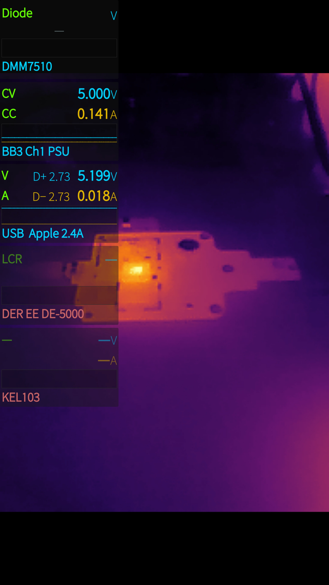

# LabCam (harbour-labcam)

A Sailfish OS camera app for **electronics-lab / bench work**. It is a fork of
[piggz/harbour-advanced-camera](https://github.com/piggz/harbour-advanced-camera)
that keeps the full advanced-camera feature set and adds four things on top:

1. a **live measurement overlay** of bench instruments (multimeter, PSU,
   electronic load, USB tester) drawn over the viewfinder,
2. **burning that overlay (and everything else below) into the saved photo**,
3. a **thermal-camera mode** for a plugged-in InfiRay P2 Pro USB camera (live
   false-colour image *plus* real temperature read-out: hotspots, tap-to-measure
   points and a colour bar), and
4. an optional **component-identification** mode (select a part in the frame, a
   companion PC service identifies it and the result is burned into a photo).

It installs **next to** the original advanced-camera (different package, binary,
icon, data path and Sailjail identity) so both can be used independently.

> This README focuses on **what differs from upstream advanced-camera**. For the
> generic camera features (resolutions, ISO, focus, effects, gallery, …) refer to
> the upstream project — that code is unchanged here.

---

<p align="center">
 
 


 
</p>

---

## ⚠️ Status & security notice

This is a **proof-of-concept (POC) / work-in-progress (WIP)**, shared for interest
and reference — not a finished product.

It was built and used **only on a private, isolated lab network with no exposure to
the outside world**, so **information security was deliberately not a design goal**.
Concretely: the network services it talks to (instrument WebSocket, component-ID
HTTP service, instrument web dashboard, device web UIs) have **no authentication,
no transport encryption, no input hardening and no access control**, and some
credentials/config are handled in plaintext. The app trusts whatever it receives.

**Do not expose any part of this system to an untrusted network or the public
internet.** Run it only inside a trusted LAN. Use at your own risk.

---

## License

* The app inherits upstream's license: **GPL-2.0-or-later**, with some files
  under LGPL-2.1+ (see `LICENSE` and the per-file headers from upstream).
* All **LabCam additions** in this repository are **GPL-2.0-or-later** as well
  (see the SPDX headers in the new source files).
* Original camera application © Adam Pigg and the advanced-camera contributors.

---

## How it differs from AdvancedCam — feature by feature

### 1. Live instrument overlay (new)

A QtWebSockets client connects to a **lab data server** on the network that
broadcasts instrument readings as JSON (~5 Hz). The overlay shows up to five
panels with two value rows each plus a scrolling history graph:

| Panel | Typical device          | Shows                          |
|-------|-------------------------|--------------------------------|
| DMM   | bench multimeter        | mode, value+unit, range graph  |
| PSU   | programmable PSU (CV/CC)| voltage / current, output state|
| USB   | USB power tester        | V/A, D+/D−, charging protocol  |
| LOAD  | electronic load         | mode (CC/CV/CR/CW), V/A        |
| LCR   | LCR meter (placeholder) | greyed out until wired up      |

Key display rule ported from the original lab overlay: **the DMM reading follows
the instrument's reported range, not the momentary value** — the unit (µV/mV/V…)
and the graph's Y-scale are tied to the meter range so the display doesn't jump
between scales when the value changes inside one range. A range step-down is held
for ~32 s until the old trace has scrolled off the graph. Diode mode is always
shown in volts; a near-zero reading shows a red **"Shorted"**.

Layout adapts to orientation (derived from the page geometry, not guessed from
the bar): four/five panels across the top in landscape, a narrow strip on the
left/top in portrait.

New files: `qml/overlay/InstrumentClient.qml`, `InstrumentBar.qml`,
`InstrumentPanel.qml`, `ScrollGraph.qml`, `OverlayConfig.js`.

### 2. Burn overlay into the photo (new)

On shutter the overlay is rendered (up-scaled so distance-field text stays sharp)
and **composited into the captured photo by a C++ compositor** (`ImageOverlay`,
`QPainter`-based). The result is saved **non-destructively** as `<name>_ovl.jpg`;
the photo is loaded with EXIF auto-transform so it stays upright. WYSIWYG: it
burns in whatever is on screen, even without a live data connection.

New file: `src/imageoverlay.{h,cpp}` (context property `imageOverlay`).

### 3. Thermal camera — InfiRay P2 Pro (new)

A native **V4L2 capturer** opens the P2 Pro (UVC `0bda:5830`, typically
`/dev/video2`), streaming YUYV **256×384** in its own thread. The top half is the
image, the bottom half is **16-bit per-pixel temperature data**.

* The image half is auto-contrasted, mapped through an **INFERNO** palette,
  up-scaled ×3 and sharpened with an unsharp mask ("superfine") and served to QML
  via a `QQuickImageProvider` (`image://thermal/<frame>`).
* The temperature half is decoded to **°C using `raw / 64 − 273.15`** — the InfiRay
  P2 Pro / TC001 convention openly documented by the thermal-camera community (e.g.
  Les Wright's GPL pyThermalCamera, where this formula is in the source). A tunable
  `tempOffset` allows on-device calibration.
* Per frame the min/max (with positions) are computed and a temperature grid is
  kept for tap queries.

In the UI a button cycles **off → area → fullscreen**. In *area* mode the IR
image sits in the lower half (portrait) or the bottom-right corner (landscape);
in *fullscreen* it fills the page. The image is rotated per device orientation so
it is always upright. Two more buttons toggle:

* **hotspots / measurement points** — red (max) and cyan (min) crosses with °C,
  plus user points added by tapping the IR image (tap near a point to remove it),
* **colour bar** — an INFERNO gradient with the current min/mid/max °C.

Marker text is drawn **upright** on a `Canvas` overlay (it does not rotate with
the image, so it stays readable in every orientation) and is captured into the
photo automatically (the overlay is a child of the grabbed item). The thermal
image is composited into the photo at its on-screen position
(`ImageOverlay::burnImageRect`). Only one image is saved per shot (the bare
original is removed when an overlaid version exists).

New file: `src/thermalcamera.{h,cpp}` (context property `thermalCam` + image
provider `thermal`).

### 4. Component identification (new, optional)

A "magnifier" mode shows a selection frame (white corner brackets). On shutter the
selected region is sent to a **companion PC service** over HTTP; the returned
description (manufacturer/value/datasheet link/expected readings) is shown in a
result card and can be composited onto the real photo together with a silhouette
of the part (`IMG_<ts>_id.jpg`). The phone holds **no API key** — all model
access lives in the PC service.

New files: `src/componentid.{h,cpp}` (context property `componentId`),
`qml/overlay/ComponentCard.qml`.

### 5. Rebranding & coexistence

Renamed to **harbour-labcam** ("Lab Camera"): own package / binary / desktop /
icon / data path and a neutral Sailjail identity, own dconf path. The QML import
URI is left as upstream's (process-internal only). The `.desktop` requests the
`Internet` permission (needed for the WebSocket + HTTP service calls).

---

## Architecture / data flow

```
 lab data server  ──ws://<host>:7891 (JSON STATE, ~5 Hz)──┐
                                                          │
 InfiRay P2 Pro  ──UVC /dev/video2 (YUYV 256×384)──┐      │
                                                   │      ▼
                              ThermalCamera ──► InstrumentClient
                              (V4L2 thread)          │
                                   │                 ▼
        image://thermal  ◄─────────┘        InstrumentBar (panels + graphs)
                                   \             /
                                    Overlay over the VideoOutput (viewfinder)
                                                   │
                 shutter ─► grab overlays ─► ImageOverlay.burn* ─► <name>_ovl.jpg
                                                   │
 component-id PC service ◄── HTTP POST ROI ── ComponentId ──► result card
```

The phone is only a **client**: it reads the instrument STATE WebSocket and POSTs
to the component-id service. It never writes to the lab or runs the models itself.

---

## Build & install (Sailfish SDK)

```bash
# Build (adjust target to your installed Sailfish SDK target)
~/SailfishOS-Platform-SDK/mb2 -t SailfishOS-5.0.0.62-aarch64 build
# -> RPMS/harbour-labcam-<ver>.<arch>.rpm

# Deploy (example)
scp RPMS/harbour-labcam-*.rpm root@<phone>:/tmp/
ssh root@<phone> "rpm -U --force /tmp/harbour-labcam-*.rpm"
```

### Runtime dependency (important)

The QML module **`QtWebSockets 1.0`** must be present on the device, otherwise the
QML root fails to load (white screen). Install the plugin once:

```bash
ssh root@<phone> "zypper -n in qt5-qtdeclarative-import-websockets"
```

It is also listed as a `Requires:` in `rpm/harbour-labcam.yaml`.

---

## Configuration

* **Instrument WebSocket URL** — `DEFAULT_WS_URL` in
  `qml/overlay/OverlayConfig.js` (default points at an example LAN address; change
  it to your data server).
* **Component-ID service URL** — in `src/componentid.cpp`.
* The thermal device path defaults to `/dev/video2` (overridable in
  `ThermalCamera::start`).

The data server's JSON STATE schema (the contract this app consumes) is documented
in the companion PC package. This repository does not include the server.

---

## Hardware notes

* **InfiRay P2 Pro**: UVC `0bda:5830`. On the test device the sandboxed app may
  open `/dev/video2` because the user is in the `camera`/`video` groups — no extra
  permission was needed. The live viewfinder crop/zoom for IR alignment affects
  the live view only, not the saved photo (the photo uses the full sensor /
  on-screen IR position).
* Temperature accuracy is good below ~160 °C; very hot targets may clip and
  benefit from emissivity handling that is out of scope here.

---

## Credits

* **harbour-advanced-camera** by Adam Pigg and contributors — the camera app this
  is built on. <https://github.com/piggz/harbour-advanced-camera>
* InfiRay P2 Pro temperature convention from the open thermal-camera community —
  e.g. Les Wright's GPL pyThermalCamera, which documents `°C = raw/64 − 273.15`.
